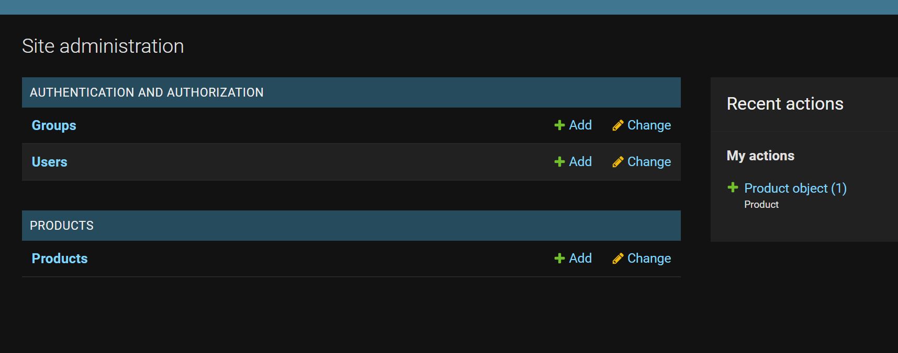
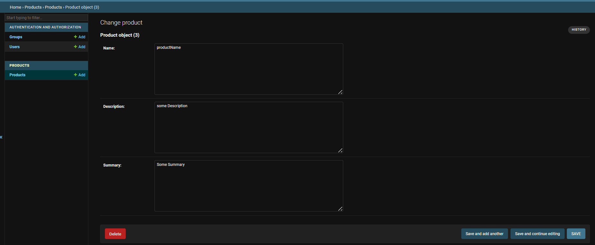
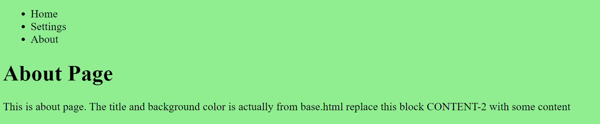

# Django

## Table of Contents
1) [Start Project](#id1)
2) [Runs Server](#id2)
3) [Sync settings with django project](#id3)
4) [Admin login](#id4)
5) [Start apps](#id5)
6) [Adding models](#id6)
7) [Customizing Home page](#id7)
8) [Django Templates](#id8)
9) [Django Templating Engine Basics](#id9)
10) ['Include' Template tag](#id10)
11) [Rendering context in a template](#id11)

### Install django
```pip install django```

***

<div id="id1"></div>

### 1) Start Project
```commandline
django-admin startproject projectname
```
```
RESULTANT FOLDER STRUCTURE

-projectname
        -asgi.py
        -settings.py
        -urls.py
        -wsgi.py
        -__init__.py
-db.sqlite3
-manage.py
```

***

<div id="id2"></div>

### 2) Runs Server
``` 
python manage.py runserver
```

***

<div id="id3"></div>

### 3) Sync settings with django project

```commandline
python .\manage.py migrate
```

***

<div id="id4"></div>

### 4) Admin login

In settings, we have installed apps
> INSTALLED_APPS = [
    'django.contrib.admin',
    'django.contrib.auth',
    'django.contrib.contenttypes',
    'django.contrib.sessions',
    'django.contrib.messages',
    'django.contrib.staticfiles',
]

Let's try admin..

go to url `http://127.0.0.1:8000/admin/`

#### Create superuser (Super Admin)

```
python manage.py createsuperuser
```
enter username, email(optional), password to create account

try it in website..

Now admin can add users with name and email and do other stuffs in the website itself

***

<div id="id5"></div>

### 5) Start apps

```commandline
 python manage.py startapp appname 
```

Used to create different apps as required.

> Inside appname folder in root ( same location as manage.py)
> 
>        -migrations
>               -__init__.py
>        -admin.py
>        -apps.py
>        -models.py
>        -tests.py
>        -views.py
>        -__init__.py

***

<div id="id6"></div>

### 6) Adding models

* Write a new model/class in model.py file, in appname
    ```python
    class Product(models.Model):
        name = models.TextField()
        description = models.TextField()
    
    ```

* Then execute following commands

    `python manage.py makemigrations`
    `python manage.py migrate`

  
* If new fields are added in model after doing these, we need to put default value also
    ```python
    summary = models.TextField(default="Default text, enter something")
    ```
    Execute both migration commands after changing models

* Then register these models in admin site
    ```python
    # my imports
    from .models import Product
    
    # Register your models here.
    admin.site.register(Product)
    ```

* Also add app name(ex: products) in settings file installed app list

    >INSTALLED_APPS = [
        'django.contrib.admin',
        'django.contrib.auth',
        'django.contrib.contenttypes',
        'django.contrib.sessions',
        'django.contrib.messages',
        'django.contrib.staticfiles',
        'products',
    ]

* Now visit url for testing these `http://127.0.0.1:8000/admin/`




#### Creating product objects using shell

* Start shell in command line
`python manage.py shell`

* Import the `Product` class we created 
```python
from products.models import Product
```

* To see all objects of the class created till now
`Product.objects.all()`

* To create a new object for 'Product' class
```python
Product.objects.create(name='productName',description='some Description',summary='Some Summary')
```
* Product object gets updated in site



#### Other model fields

```python
name = models.CharField(max_length=50)
description = models.TextField(blank=True,null=True)
price = models.DecimalField(max_digits=100, decimal_places=2)
```

if we want to add a new field in model, use default parameter

Remember to do makemigrations and migrate

***

<div id="id7"></div>

### 7) Customizing Home page

* First create another app for pages say `pages`
    ```commandline
    python manage.py startapp pages
    ```

* Inside views.py in pages, write function for home view
    ```python
    from django.http import HttpResponse
    
    def home_view(*args, **kwargs):
        return HttpResponse("<h1>Hello World</h1>")
    ```

* Inside urls.py in django configuration folder, add path for home_view
    ```python
    from pages.views import home_view
    
    urlpatterns = [
        path('admin/', admin.site.urls),
        path('', home_view, name='home'),
    ]
    ```

* Now `http://127.0.0.1:8000/` gives home_view  

NOTE: home_view function will have a request argument.(If we didnt put it,then it comes under args)
`home_view(request, *args, **kwargs):`
So we can get user using this `print(request.user)`

***

<div id="id8"></div>

### 8) Django Templates

* Create templates folder along with other folders(pages,products..)
* Add templates folder path in settings file

    `'DIRS': [os.path.join(BASE_DIR, "templates")],`

* Create html file in templates folder  ( say  `about.html`)

* In views file, link this html file to respective view
    ```python
    def about_view(request, *args, **kwargs):
        return render(request, 'about.html', {})
    ```

* See it in `http://127.0.0.1:8000/about`

***

<div id="id9"></div>

### 9) Django Templating Engine Basics
`{{ request.user }}` prints current username in site

* Most pages will have duplicate html contents. So put those in base.html file and extend/ inherit it to other html files/pages

#### base.html
    ```html
    <!DOCTYPE html>
    <html lang="en">
    <head>
        <meta charset="UTF-8">
        <title>Learning Django</title>
    </head>
    <body bgcolor="lightgreen">
    
    replace this block CONTENT-1 with some content
    
    
    
    replace this block CONTENT-2 with some content
    <h1>{{ request.user }}</h1>
    
    
    </body>
    </html>
    ```

* To inherit these (title and background color) to about page,
#### about.html
```html



<h1>About Page</h1>
<p1>This is about page. The title and background color is actually from base.html</p1>

```

Note: here, `about.html` inherits all contents from `base.html`. Also, `about.html` replaces contents inside `content_1` block with its own contents, but doesn't replaces `content_2`. Thus content_2 block code of `base.html` gets implemented in `about.html` also.

***

<div id="id10"></div>

### 10) 'Include' Template tag

To add a html content in between some html.

Ex: To add a navigation menu to all pages, include `navigation.html` in `base.html`

#### navigation.html
```html
<nav>
    <ul>
        <li>Home</li>
        <li>Settings</li>
        <li>About</li>
    </ul>
</nav>
```

#### Add this to body of base.html

```

```



***

<div id="id11"></div>

### 11) Rendering context in a template

Sending data/context from backend to frontend

* pass context dict in respective view
    ```python
    def about_view(request, *args, **kwargs):
        about_context = {
            "some_key_1": "some value",
            "some_key_2": 458
        }
        return render(request, 'about.html', about_context)
    ```

* Access it in html file using keys of context dict
    ```html
    <h2>Contexts from backend: {{ some_key_1}} and also {{ some_key_2}}</h2>
    ```

***

#### For loop in template (List in context)

Context:
```python
    about_context = {
        "list_of_values": [55, 66, 77]
    }
```

html page
```html
<h3>Context List: {{ list_of_values }}</h3>
```
```Output: Context List: [55, 66, 77]```

```html
<ul>

    <li>{{ each_value }}  </li>

</ul>
```

```
Output: 55
        66
        77 
```

***

#### Conditions in Template

####  IF condition (else is optional)
```html

<h2>IF Condition Result: True</h2>

<h2>IF Condition Result: False</h2>

```
`elif` can also be used in django

#### For loop counter OR index
`{{ forloop.counter }}`

***

#### Filters

* Adds `10` to the value of `some_key_2` and displays it
    ```html
    <h3>{{ some_key_2|add:10 }}</h3>
    ```

* `{{ some_key_2|upper }}`   Turns to UPPER CASE
* `{{ some_key_1|capfirst }}` Turns first letter to Caps
* `{{ html_code|safe }}` implements html instead of displaying code itself
> Refer django docs for built in template tags & filter
> https://docs.djangoproject.com/en/4.0/ref/templates/builtins/

***

